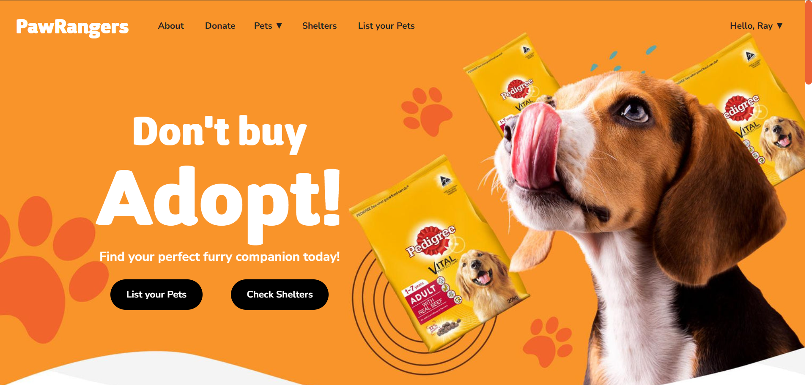

# PawRangers - A Pet Adoption Website

**PawRangers** is a pet adoption website designed to connect rescue animals with loving homes. Built using HTML, CSS, JavaScript, Tailwind,  PHP, and MySQL.




# Key Features


##  User-friendly Interface

PawRangers provides an intuitive interface for users to easily navigate through pet listings, view details, and initiate adoption processes.

## Search and Filter Options

Users can search for pets based on various criteria such as species, breed, age, and location, ensuring they find the perfect match for their lifestyle.

## Pet Profiles

Each pet has a detailed profile featuring images, descriptions, temperament, and medical history, enabling potential adopters to make informed decisions.


# Getting Started


To run PawRangers on your local machine, follow these steps:

1.  Extract the files in the computer.
2.  Install dependencies:
    -   Ensure you have PHP and MySQL installed on your machine.
    -   Set up a local server environment like XAMPP or WAMP.
3.  Import the database:
    -   Create a new database named `pet_info`.
    -  Create a new table inside the database `pet_info` named `pet_info` and `users`.
```
CREATE TABLE pet_info (
    sno INT AUTO_INCREMENT PRIMARY KEY,
    pet_name VARCHAR(255),
    pet_breed VARCHAR(255),
    pet_location VARCHAR(255),
    pet_gender VARCHAR(10),
    pet_weight VARCHAR(20),
    pet_category VARCHAR(50),
    pet_age VARCHAR(20),
    pet_phone VARCHAR(20),
    pet_image BLOB,
    dt DATETIME
);
```
```
CREATE  TABLE  users (
sno  INT  AUTO_INCREMENT  PRIMARY  KEY,
name  VARCHAR(255) NOT  NULL,
email  VARCHAR(255) NOT  NULL,
password  VARCHAR(255) NOT  NULL,
dt  TIMESTAMP  DEFAULT  CURRENT_TIMESTAMP
);
```
4.  Start the server:
    -   Launch your local server environment.
    -   Navigate to the project directory and open `index.php` in your browser.
6.  You're all set! You should now see PawRangers running on your local machine.


# Contributing

We welcome contributions to enhance PawRangers. Feel free to submit pull requests with new features, improvements, or bug fixes.

## License

PawRangers is licensed under the [MIT License.](https://github.com/jescalan/accord/blob/master/license.md)


